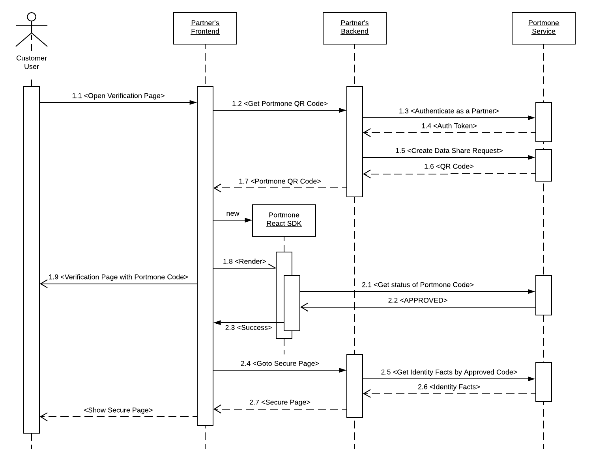

## Portmone Integration Guide

Portmone is a service that allows user to share the proven identity facts with 3rd parties without the need to share any of the government issued documents.

This document provides an information about the way the integration is implemented and reveals it from the Partner perspective.

Partner's integration includes:

1. Partner's authentication (issue of authentication token)
2. Data share request generation and presenting QR code to the Customer
3. Getting the event of data share request acceptance by the Customer

The sequence diagram below sheds a light on integration details. Let's inspect it.

